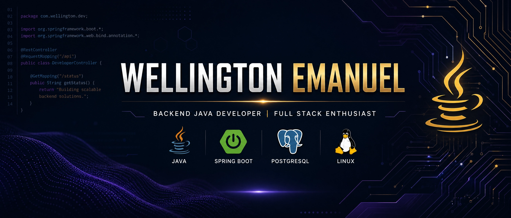

  

<h3 align="center">Wellington Emanuel</h3>

  <strong>Backend Java Developer | Full Stack Enthusiast</strong>

---

## Sobre Mim

Sou Wellington Emanuel, um **Desenvolvedor Java Backend** com mais de 2 anos de experiência, apaixonado por engenharia de software e arquitetura de sistemas robustos e escaláveis. Possuo experiência em todo o ciclo de desenvolvimento, desde a modelagem e arquitetura de APIs REST até a integração de serviços, gerenciamento de banco de dados e deploy em ambientes Linux. Minha abordagem prioriza **Clean Code**, princípios **SOLID** e **Design Patterns**, garantindo soluções de alta qualidade e fácil manutenção. Tenho também um forte interesse e experiência complementar em desenvolvimento Front-End com React e TypeScript, o que me confere uma visão Full Stack para a construção de aplicações.

---

## Tecnologias e Ferramentas

  

---

## Estatísticas do GitHub

  
  
  

---

## Projetos em Destaque

### 1. CompareJson
- **Descrição:** Biblioteca Java para comparação estrutural de JSON, identificando adições, modificações e remoções. Publicada via JitPack.
- **Tecnologias:** Java, Jackson, Gradle
- **Repositório:** [emnuelht/compareJson](https://github.com/emnuelht/compareJson )

### 2. JsonToSQL
- **Descrição:** Ferramenta que converte arquivos JSON em comandos SQL prontos para uso em bancos de dados MySQL, ideal para automatizar a criação de tabelas e colunas a partir de estruturas JSON padronizadas.
- **Tecnologias:** Java, SQL, Gradle
- **Repositório:** [emnuelht/json-to-sql](https://github.com/emnuelht/json-to-sql )

### 3. Sistema de Gestão Hierárquica (Laravel)
- **Descrição:** Sistema de gerenciamento para organizar e controlar informações relacionadas a grupos, bandeiras, unidades e colaboradores, com funcionalidades de auditoria e controle de acesso.
- **Tecnologias:** PHP, Laravel, Livewire, MySQL, Blade, JavaScript, HTML, CSS
- **Repositório:** [emnuelht/sistema-gestao](https://github.com/emnuelht/sistema-gestao )

### 4. Sistema de Coleta e Gestão de Dados de Campo
- **Descrição:** Aplicação mobile offline-first para coleta de dados, com sincronização inteligente, formulários dinâmicos, gestão de famílias e moradores, RBAC, dashboard com estatísticas e 2FA.
- **Tecnologias:** Java, Spring Boot, React, TypeScript, Android, APIs REST, Linux, VPS, Banco de dados relacional

---
## Conecte-se Comigo

